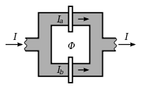
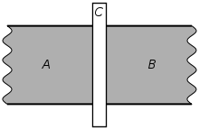
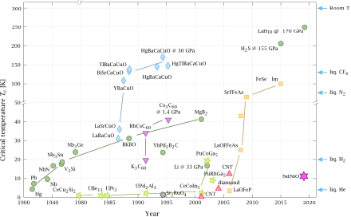
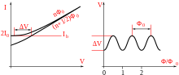

# Last Seminar
- $\red {T\rightarrow}$ $\red T_{c}$ 
    - critical $B_c$ vanishes at transition temperature.
    - $\Delta S$ change in entropy vanishes at transition temperature
    - $\Delta Q= T_c (S_n -S_s)=0$ the change in latent heat is zero 
    - so transition at this is of the Second order transition
.

- $\red {T\rightarrow  0}$
    - the magnetic field derivative vanishes at T=0
    - entropy vanishes

$\red {0<T<T_c}$
- $\Large\frac{d B_c}{d T}<0$ in the intermediate range
- $\Delta S\neq 0$  so the superconductivity transition in a magnetic field is accompanied by a latent heat, so phase transition is of first order.
- $\circ$ Latent heat : energy released or absorbed by a body during a first  phase transition.
- $\circ$ Passing adiabatically through the phase boundary from higher to lower magnetic field leads to cooling of the specimen

$\blue{ِA) \underline{  London Equations }}$  
- in Drude mode ideal conductivity is represented by ommiting collision term
    - collision term:  $\frac{mv}{\tau} .$ , So      $m\dot{v}=-e \vec{E}$
    - $j_s =-n_s e \vec{v}  .$ $\rightarrow \frac{d j_s}{d t}=-n_s e \dot{v} \text{ } .$
    -$\frac{d j_s}{d t}=\frac{n_s e^2}{m}\vec{E}$    $\blue{\text{First London Equation}}$
- in superconductors time derivative of current is proportional to the electric field
- due to vanishing resistivity electric field also vanishes in stationary state
    - temporal variation of current vanishes.
$\blue{\text{Second London Equation}}$
$\frac{\partial}{\partial t}(\nabla\times j_s +\frac{n_s e^2}{m}B)=0$
- this equation shows that in ideal conductors the magnetic flux throught an arbitrary loob inside a sample cant varry with time .
    - $\red{\text{In superconductors magnetic flux is zero  }}$
    - this requires that the expression in bracket vanishes leading to the second london equation, giving the second London equation
    - $\nabla \times j_s =-\frac{n_s e^2}{m}B$
  $\green{\underline{Penetration Depth} }$: $\lambda _L =\sqrt{\frac{m}{\mu n_s e^2}}$

$\Large \underline{\text{B) Pippard's Equation: -}}$

- penetration depth may be deduced by measurements of the magnitization of small particles.
- Pippard measured the frequency shift of superconductor resonators when driven normal by magnetic field.
- variation of penetration length with mean free path
- anisotropy : variation of material properties along axis in different directions
- so pippard found that $\lambda$ of pure tin exhibits and anisotropy while impure specimens is isotropic.
- $\red {\text{london second equation is incapapule and has to be re-placed  by a }}$,$\red{\text{more complex non local expression}}$

$\underline{\large \text{C) Microscopic theory of superconductivity(Cooper Pairs): -}}$
- Cooper suggested that ground state of Fermi-gas becomes unstable if a small attractive interaction between electron pairs exits.
- example :
    - drop 2 electrons in a Fermi sea , they stay at the surface as the lower states are occupied but is interaction exists they immerse into Fermi sea.
- the coulomb repulsion between electrons makes it hardly possible for this attractive interaction to exist until the discovery of Strong Coulomb repulsion.
- Isotope effect: the transition temperature of superconductors depends on the atomic mass of material.
- transition temperature is inversely proportional to square root of atoms mass.
- then hence is proportional to Debye frequency.
- An electron flying through a lattice of positive ion cores exerts an attractive force on the ions, and causes a positively charged cloud in its ‘wake’. This surplus of positive charge (‘over screening’) in turn attracts a second electron. The development of the ion cloud is retarded because it will take half of the period of the lattice vibration until the maximum charge density is reached. During the typical time t ≈ 10−13 s, the first electron has already covered a distance s = vFt ≈ 108 × 10−13 cm = 1000 ˚A. Because of this ‘retardation effect’, the interacting electrons are rather far apart, and the Coulomb repulsion between them is reduced.
- the attractive interaction can be pictured as an exchange of phonons that are virtual because at low temperatures electrons cannot undergo sufficient energy changes to create phonons of short wavelength. The energy change is due to the intermediate state in which one of the electrons emits a phonon with the wave vector q that is then absorbed by the other. In this process the centre-of-mass momentum ℏK is conserved, i.e., k1 + k2 = k′ 1 + k′ 2 = K. In second-order perturbation theory the corresponding matrix element reads 

$\underline{\green{\text{DGinzburg-Landau Theory}}}$
- based on Landau's theory of second order phase transitions
    - free energy is expanded with respect to an order parameter $\Phi=\frac{n_\uparrow - n_\downarrow}{n_\uparrow + n_\downarrow}$
    - $\Phi$ varries from 1 to 0
    -  gives good description only in temperatures near $T_c$

### Applications

SQUID: A highly sensitive magnetometer based on the principles of superconductivity and quantum mechanics

<!--StartFragment-->

The DC SQUID was invented in 1964 by Robert Jaklevic, John J. Lambe, James Mercereau, and Arnold Silver of Ford Research Labs[\[3\]](https://en.wikipedia.org/wiki/SQUID#cite_note-Jaklevic64-3) after [Brian Josephson](https://en.wikipedia.org/wiki/Brian_Josephson "Brian Josephson") postulated the [Josephson effect](https://en.wikipedia.org/wiki/Josephson_effect "Josephson effect") in 1962
<!--StartFragment-->

 It has two Josephson junctions in parallel in a superconducting loop. It is based on the DC Josephson effect. In the absence of any external magnetic field, the input current  splits into the two branches equally. If a small external magnetic field is applied to the superconducting loop, a screening current, , begins to circulate the loop that generates the magnetic field canceling the applied external flux, and creates an additional Josephson phase which is proportional to this external magnetic flux.[\[5\]](https://en.wikipedia.org/wiki/SQUID#cite_note-5) The induced current is in the same direction as  in one of the branches of the superconducting loop, and is opposite to  in the other branch; the total current becomes  in one branch and  in the other. As soon as the current in either branch exceeds the critical current, , of the [Josephson junction](https://en.wikipedia.org/wiki/Josephson_junction "Josephson junction"), a voltage appears across the junction.

<!--EndFragment-->

<!--EndFragment-->

SQUIDs enable precise measurement of extremely small magnetic fields, revolutionizing magnetic sensing technology

Explain the concept of flux quantization and its significance in SQUID operation

*   Magnetic flux through a superconducting loop is quantized in units of the flux quantum (Φ0), ensuring precise magnetic field measuremen

*   List the advantages of using SQUIDs:

    *   High sensitivity to magnetic fields: Capable of detecting femtotesla-level magnetic fields
    *   Wide operating temperature range: Can operate at cryogenic temperatures as well as higher temperatures for certain types of superconductors
    *   Ability to detect both DC and AC magnetic fields: Versatile in various measurement scenarios
    *   Non-invasive measurement technique: Does not require direct contact with the sample being measured, minimizing disturbances

<!--StartFragment-->

 study the [Cosmic microwave background](https://en.wikipedia.org/wiki/Cosmic_microwave_background "Cosmic microwave background"), for [X-ray astronomy](https://en.wikipedia.org/wiki/X-ray_astronomy "X-ray astronomy"), to search for dark matter made up of [Weakly interacting massive particles](https://en.wikipedia.org/wiki/Weakly_interacting_massive_particles "Weakly interacting massive particles"), and for spectroscopy at [Synchrotron light sources](https://en.wikipedia.org/wiki/Synchrotron_light_sources "Synchrotron light sources").

<!--EndFragment-->
<!--StartFragment-->

SQUIDs constructed from super-cooled [niobium](https://en.wikipedia.org/wiki/Niobium "Niobium") wire loops are used as the basis for [D-Wave Systems](https://en.wikipedia.org/wiki/D-Wave_Systems "D-Wave Systems") 2000Q [quantum computer](https://en.wikipedia.org/wiki/Quantum_computer "Quantum computer").[\[27\]](https://en.wikipedia.org/wiki/SQUID#cite_note-27)

<!--EndFragment-->
<!--StartFragment-->

SQUIDs are being used as detectors to perform [magnetic resonance imaging](https://en.wikipedia.org/wiki/Magnetic_resonance_imaging "Magnetic resonance imaging") (MRI)

<!--EndFragment-->

<!--StartFragment-->

**High-temperature superconductors** (**high-Tc** or **HTS**) are defined as materials with critical temperature (the temperature below which the material behaves as a [superconductor](https://en.wikipedia.org/wiki/Superconductor "Superconductor")) above 77 K (−196.2 °C

<!--EndFragment-->

https://upload.wikimedia.org/wikipedia/commons/thumb/b/bb/Timeline_of_Superconductivity_from_1900_to_2015.svg/440px-Timeline_of_Superconductivity_from_1900_to_2015.svg.png
<!--StartFragment-->

Timeline of superconductor discoveries. On the right one can see the liquid nitrogen temperature, which usually divides superconductors at high from superconductors at low temperatures. [Cuprates](https://en.wikipedia.org/wiki/Cuprate "Cuprate") are displayed as blue diamonds, and [iron-based superconductors](https://en.wikipedia.org/wiki/Iron-based_superconductor "Iron-based superconductor") as yellow squares. [Magnesium diboride](https://en.wikipedia.org/wiki/Magnesium_diboride "Magnesium diboride") and other low-temperature or high-pressure metallic [BCS superconductors](https://en.wikipedia.org/wiki/BCS_superconductor "BCS superconductor") are displayed for reference as green circles.

<!--EndFragment-->

<!--StartFragment-->

Cuprates are layered materials, consisting of superconducting layers of copper oxide, separated by spacer layers. Cuprates generally have a structure close to that of a two-dimensional material.

<!--EndFragment-->

<!--StartFragment-->

superconductivity breaks down as soon as the current density passes a critical value that is independent of the origin of the current

<!--EndFragment-->
